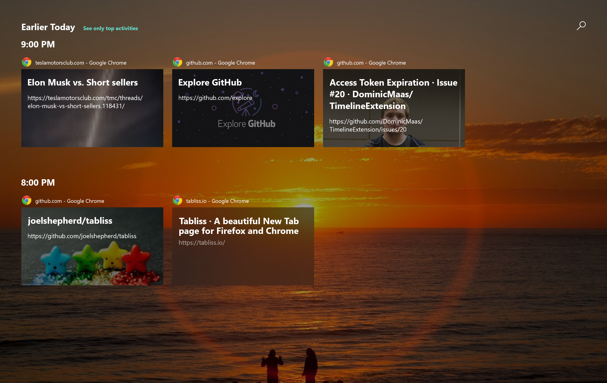
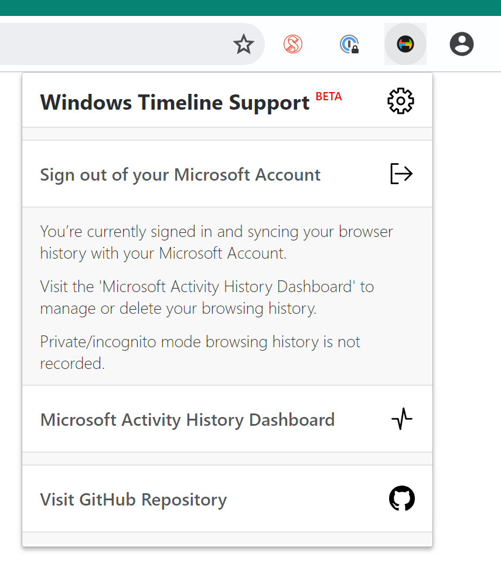

# Windows Timeline Support - Web Extension

A web extension that integrates Windows Timeline support into popular browsers.

## Introduction

Windows Timeline Support is a web extension that integrates Windows Timeline support into popular browsers. This is done by publishing your browsing history as activities to the Microsoft Graph (so a Microsoft Account is required to use this extension). Personal Microsoft Accounts are confirmed to work, work and school accounts should work.

A list of known issues and planned features is located below. Before opening a new issue, check that it's not mentioned below and does not already exist.

See frequently asked questions [here](FAQ.md).

## Browser Support

|Browser|Supported|Download|Note|
|--|--|--|--|
|Google Chrome|Yes|[Chrome Web Store](https://chrome.google.com/webstore/detail/windows-timeline-support/meokcjmjkobffcgldbjjklmaaediikdj)|Fully Supported|
|Firefox|Yes|[Firefox Addons](https://addons.mozilla.org/en-GB/firefox/addon/windows-timeline-support/)|Fully Supported|
|Microsoft Edge|No|n/a|Microsoft Edge already has Windows Timeline integration. Might release a version that only contains Project Rome support.|
|Vivaldi| Yes |[Chrome Web Store](https://chrome.google.com/webstore/detail/windows-timeline-support/meokcjmjkobffcgldbjjklmaaediikdj)|Supported Icon Assets. Chrome OAuth Base.|
|Opera|No|n/a| Use tool to install from Chrome Web Store. Supported Icon Assets.|

## Version History

### 1.0.2

* Testing support for Firefox Mobile login.
* Fixed scaling issue for Firefox Mobile.
* Fix issue where websites would be stored in your feed while in private mode.
* Added recent activities button.
* Added Opera icon assets.
* Potentially fixed an issue where timeline activities would not appear or take a while to appear.

### 1.0.1

* Initial public beta.

## Setup

1. Clone the repository and open it.
2. Run `npm install`.
3. Run `npm run build` to build files or `npm run watch` for debugging.
4. Open browser, load unpacked extension in the `extension` folder.

## Known Issues

*None at the moment*

## Planned Features

- Toggle switch for a built in ignore list (will include login urls, url shorteners etc.)
- Ability to add a custom ignore list.

## More Screenshots

## Authors

- **Dominic Maas** - *Initial Work and Lead* - [Twitter](https://twitter.com/dominicjmaas)
- **Daniel Aleksandersen** - *Firefox Port, Icon and Other Misc Changes* - [Homepage](https://www.daniel.priv.no/)

See also the list of [contributors](https://github.com/DominicMaas/TimelineExtension/graphs/contributors) who participated in this project.

## License

This project is licensed under the MIT License - see the [LICENSE.md](LICENSE.md) file for details

## Acknowledgments

- [Bytesize Icons](https://github.com/danklammer/bytesize-icons)
